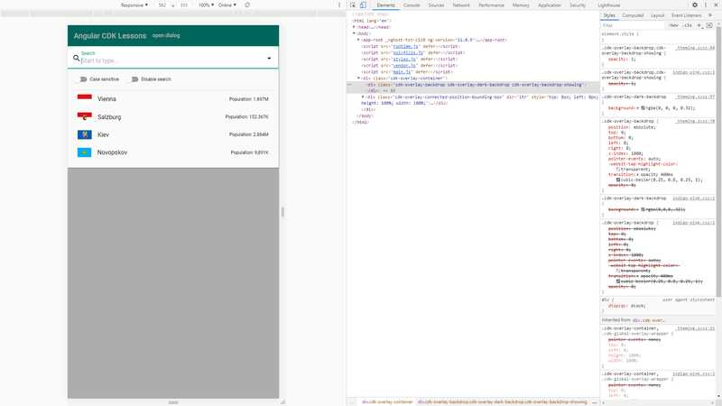
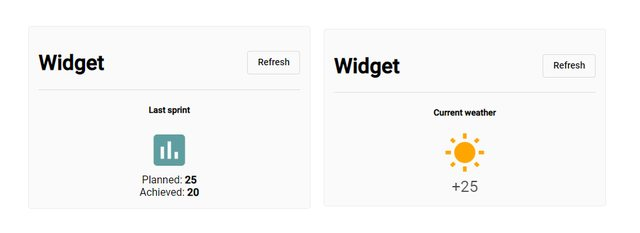

# :zap: Angular Material Advanced

This is code by Dmytro Mezhenskyi, from [Decoded Frontend](https://www.youtube.com/c/DecodedFrontend/videos) - see [:clap: Inspiration](#clap-inspiration) below, to learn a higher level of Angular programming. The main modules are:

* **advanced-search-form** search from a list of countries shown in a drop-down list
* **complex-form-control** Custom form field control with Angular Material & Reactive Forms using the [Angular Material design component library](https://material.angular.io/)
* **overlay-example** Angular Date Range Picker
* **patterns example** Bridge Angular design pattern: velocity and weather widgets using a common wrapper
* **Note:** to open web links in a new window use: _ctrl+click on link_


## :page_facing_up: Table of contents

* [:zap: Angular Material Advanced](#zap-angular-material-advanced)
  * [:page_facing_up: Table of contents](#page_facing_up-table-of-contents)
  * [:books: General info](#books-general-info)
  * [:camera: Screenshots](#camera-screenshots)
  * [:signal_strength: Technologies](#signal_strength-technologies)
  * [:floppy_disk: Setup](#floppy_disk-setup)
  * [:computer: Code Examples](#computer-code-examples)
  * [:cool: Features](#cool-features)
  * [:clipboard: Status & To-Do List](#clipboard-status--to-do-list)
  * [:clap: Inspiration](#clap-inspiration)
  * [:file_folder: License](#file_folder-license)
  * [:envelope: Contact](#envelope-contact)

## :books: General info

* Multiple tutorial modules use the same code base - selected in `app.component.html` by commenting out unused modules

Uses these Angular features

* [@ViewChild decorator](https://angular.io/api/core/ViewChild) to configure a view query
* [custom form field control](https://material.angular.io/guide/creating-a-custom-form-field-control) to be used inside mat-form-field
* [HostBinding decorator](https://angular.io/api/core/HostBinding) to mark a DOM property as a host-binding property and supply configuration metadata
* [Angular Accessibility - a11y - package](https://material.angular.io/cdk/a11y/overview) to provide a number of tools to improve accessibility. FocusMonitor is used - an injected service to listen for changes in the focus state of an element
* [ControlValueAccessor Interface](https://angular.io/api/forms/ControlValueAccessor) used as an interface that acts as a bridge between the Angular forms API and a native element in the DOM
* [@angular/core Self decorator](https://angular.io/api/core/Self) used on constructor parameters to tell the DI framework to start dependency resolution from the local injector.
* [@angular/core Optional decorator](https://angular.io/api/core/Optional) used on constructor parameters, which marks the parameter as being an optional dependency. The DI framework provides null if the dependency is not found.
* [Angular material overlay directive](https://github.com/angular/components/blob/master/src/cdk/overlay/overlay-directives.ts)
* [Angular CDK Overlay](https://material.angular.io/cdk/overlay/api) service to create overlays
* [Angular Material Datepicker](https://material.angular.io/components/datepicker/overview) to be able to enter a date either through text input or by choosing a date from the calendar
* [@Angular/core ContentChild](https://angular.io/api/core/ContentChild) parameter decorator that configures a content query - to get reference to the template component
* [Angular component error state](https://github.com/angular/components/blob/master/src/material/core/common-behaviors/error-state.ts)
* [DoCheck lifecycle](https://angular.io/api/core/DoCheck) to invoke a custom change-detection function for a directive, in addition to the check performed by the default change-detector.
* [ForwardRef Function](https://angular.io/api/core/forwardRef) to refer to references which are not yet defined.

RxJS

* [RxJS iif](https://www.learnrxjs.io/learn-rxjs/operators/conditional/iif) used to subscribe to first or second observable based on a condition
* [RxJS merge](https://www.learnrxjs.io/learn-rxjs/operators/combination/merge) to turn multiple observables into a single observable
* [RxJS EMPTY](https://rxjs-dev.firebaseapp.com/api/index/function/empty) to creates an Observable that emits no items to the Observer and immediately emits a complete notification - with no scheduler.
* [RxJS Subject](https://rxjs-dev.firebaseapp.com/guide/subject) a special type of Observable that allows values to be multicasted to many Observers.

## :camera: Screenshots




## :signal_strength: Technologies

* [Angular v14](https://angular.io/)
* [Angular Material v14](https://material.angular.io/)
* [RxJS v7](https://rxjs-dev.firebaseapp.com/guide/overview) library of observable sequences

## :floppy_disk: Setup

* Install dependencies using `npm i`
* `ng serve` for a dev server. Navigate to `http://localhost:4200/`. The app will automatically reload if you change any of the source files.
* Individual modules are selected in the `app.component.html` by commenting out the other modules

## :computer: Code Examples

* Init lifecycle: toggle focus, pass form changes to the onChange lifecycle hook

```typescript
ngOnInit(): void {
    this.focusMonitor.monitor(this.input).subscribe((focused) => {
      this.focused = !!focused;
      this.stateChanges.next();
    });
    this.focusMonitor
      .monitor(this.input)
      .pipe(take(1))
      .subscribe(() => {
        this.onTouch();
      });
    this.form.valueChanges.subscribe((value) => this.onChange(value));
  }
```

## :cool: Features

* Rxjs is easy to read and implement

## :clipboard: Status & To-Do List

* Status: One error: `Argument of type 'ErrorStateMatcher' is not assignable to parameter of type 'FormGroupDirective'. Type 'ErrorStateMatcher' is missing the following properties from type 'FormGroupDirective': validators, asyncValidators, submitted, _oldForm, and 50 more.ts(2345)`
* To-Do: Fix (type) error which is caused by Angular removing `CanUpdateErrorStateCtor` & `CanDisableCtor` from `@angular/material/core` as not required

## :clap: Inspiration

* All code from these Youtube tutorials by [Decoded Frontend](https://www.youtube.com/channel/UCSj1Igu3ejxqcQISNEmx8VQ) as below:

* **advanced-search-control**
* [Angular Material - Custom Form Field Control [Advanced, 2020, Pt.1]](https://www.youtube.com/watch?v=8ThVof0Rz64)
* [Angular Material - Custom Form Field Control [Advanced, 2020, Pt.2]](https://www.youtube.com/watch?v=AZsw2nRxkBk&t=8s)

* **complex-form-control**
* [Control Value Accessor in Angular [Advanced, 2020]](https://www.youtube.com/watch?v=OrmIfW8Ak3w)

* **overlay-example**
* [Angular Material CDK - Overlay Module Pt.1 (Comprehensive overview, Angular 9 / 2020)](https://www.youtube.com/watch?v=Dkh0zpsc0Zw)
* [Angular CDK - Overlay Module Pt.2 (Advanced, 2020)](https://www.youtube.com/watch?v=2pS9bYtsBRo)
* [Angular material date range picker [Detailed overview, 2020]](https://www.youtube.com/watch?v=F5bwreD6N9g)

* **patterns-example**
* [Angular Design Patterns – Bridge [Advanced, 2020]](https://www.youtube.com/watch?v=2rQOu9TmuxE)

* [Eight reasons why you should be using RxJS](https://blog.mimacom.com/eight-reasons-why-you-should-be-using-rxjs/)

## :file_folder: License

* This project is licensed under the terms of the MIT license.

## :envelope: Contact

* Repo created by [ABateman](https://github.com/AndrewJBateman), email: gomezbateman@yahoo.com
